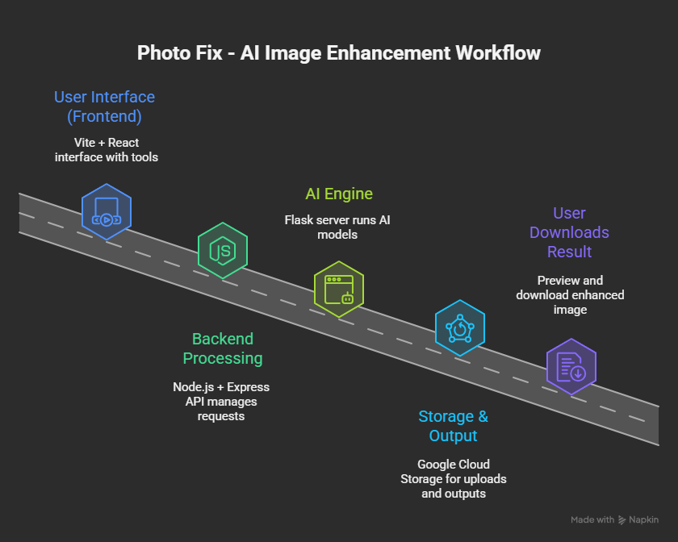

# 🪄 Photo Fix — AI-Powered Image Enhancement Suite

**Photo Fix** is an all-in-one web platform designed to transform your photos with the power of AI.  
From background removal to object detection and format conversion — everything happens in a sleek, fast, and intuitive interface.

## Workflow

## 🚀 Key Features

### 🧹 **Magic Brush**
- Instantly remove or replace image backgrounds.
- Uses AI for precise edge detection and background segmentation.
- Supports JPG, PNG, and transparent PNG outputs.

### ✂️ **Crop**
- Cut and resize images with live previews.
- Maintain aspect ratios or choose custom dimensions.

### 🔄 **Converter**
- Convert images between formats like **JPG**, **PNG**, and **WEBP**.
- Optimize file size while retaining quality.

### 🕵️ **Find Object**
- Powered by **YOLOv8** object detection.
- Detects and highlights multiple objects in an image.
- Displays bounding boxes and labels with confidence scores.

### 🧾 **Text Extractor (OCR)**
- Extract text from images in one click.
- Ideal for scanned documents, receipts, or handwritten notes.

### ↩️ **Angle Slider**
- Straighten or rotate tilted photos with a smooth UI control.
- Ideal for correcting scanned or mobile-captured images.

---

## 💡 Advanced Highlights

- 🎨 **AI Integration:** Runs YOLOv8 and background-removal models for intelligent image understanding.  
- ⚙️ **Drag & Drop Uploads:** Supports both manual upload and drag-drop zones.  
- 📂 **Cloud Storage:** Stores outputs securely on **Google Cloud Platform (GCP)** with easy download links.  
- ⚡ **Smooth Animations:** Built using **Framer Motion** for dynamic transitions.  
- 🧠 **Modern UI:** Designed with **glassmorphism**, gradient effects, and responsive layout.  
- 🔒 **Secure Backend:** Node.js + Express API for image processing, authentication, and file handling.

---

## 🖥️ Tech Stack

| Category | Technologies Used |
|-----------|-------------------|
| **Frontend** | React, Vite, Framer Motion, TailwindCSS |
| **Backend** | Node.js, Express.js, Flask (YOLOv8 Inference) |
| **Storage** | Google Cloud Storage (GCP Buckets) |
| **AI Models** | YOLOv8, Background Remover, OCR (Tesseract / EasyOCR) |
| **UI Design** | Shadcn UI, Magic UI, custom gradients |

---

## 🧩 Workflow Overview

1. Upload an image (drag & drop or click).
2. Choose your tool — *Magic Brush*, *Find Object*, *Crop*, etc.
3. AI processes the image on the backend.
4. Preview and download the enhanced output instantly.

---

## 🌐 Deployment Info

- **Frontend:** Hosted on Vite + React (localhost:5173 during development).  
- **Backend:** Flask / Node app deployed on Google Cloud VM (`https://34.131.30.185`).  
- **Domain:** Planned setup for `https://ccc.anurag11.me` with SSL via Certbot & NGINX.

---

## 📸 Preview

