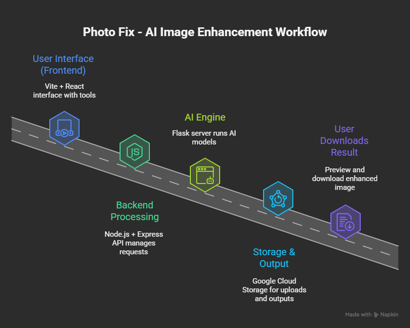

# 🪄 Photo Fix — AI-Powered Image Enhancement Suite

**Photo Fix** is a feature-rich, all-in-one web platform designed to transform, edit, and analyze your images using advanced browser-based tools and server-side AI. 

From background removal to object detection and format conversion — everything happens in a sleek, fast, and intuitive dark-themed interface built using glassmorphism, gradient effects, and smooth animations.

---

## 📸 Workflow Preview



---

## 🚀 Key Features

### 🧹 **Magic Brush**
- Instantly remove or replace image backgrounds.
- Uses AI for precise edge detection and background segmentation.
- Supports JPG, PNG, and transparent PNG outputs.

### ✂️ **Crop**
- Cut and resize images with live previews.
- Maintain aspect ratios or choose custom dimensions using `react-image-crop`.

### 🔄 **Converter**
- Convert images between formats like **JPG**, **PNG**, **WEBP**, **PDF**, and **SVG**.
- Optimize file size while retaining quality.

### 🕵️ **Find Object**
- Powered by **YOLOv8** object detection.
- Detects and highlights multiple objects in an image.
- Displays bounding boxes and labels with confidence scores.

### 🧾 **Text Extractor (OCR)**
- Extract text from images in one click.
- Ideal for scanned documents, receipts, or handwritten notes.

### ↩️ **Angle Slider**
- Straighten, rotate, scale, or apply perspective skew to tilted photos with a smooth UI control.
- Ideal for correcting scanned or mobile-captured images.

### 🤖 **Dobby AI Chatbot**
- An interactive, floating AI chatbot assistant ("Dobby") that helps users navigate the tools and answers queries during the image processing workflows.

### 🔒 **Secure User Authentication**
- Complete secure authentication suite: signup, login, verify code, forget password, and password reset. Form fields are validated in real-time with React Hook Form and Zod schemas.

---

## 💡 Advanced Highlights

- 🎨 **AI Integration:** Runs YOLOv8 and background-removal models on the backend for intelligent image understanding.  
- ⚙️ **Drag & Drop Uploads:** Supports both manual file explorer uploads and drag-and-drop zones.  
- 📂 **Cloud Storage:** Stores outputs securely on **Google Cloud Platform (GCP)** Buckets with easy download links.  
- ⚡ **Smooth Animations:** Built using **Framer Motion** for dynamic page transitions and workspace card rotations.  
- 🌀 **3D Visuals:** Employs `@react-three/fiber` and `@react-three/drei` (Three.js) for high-performance 3D visual assets in the background.

---

## 🖥️ Tech Stack

| Category | Technologies Used |
|-----------|-------------------|
| **Frontend** | React 19, Vite 7, Tailwind CSS v4, Framer Motion, Three.js (React Three Fiber & Drei) |
| **Backend** | Node.js, Express.js, Flask (YOLOv8 Inference) |
| **Storage** | Google Cloud Storage (GCP Buckets) |
| **AI Models** | YOLOv8, Background Remover, OCR (Tesseract / EasyOCR) |
| **UI Design** | Shadcn UI, Magic UI, custom gradients, custom canvas cursors |
| **Validation & State**| React Hook Form, Zod, js-cookie, localforage |

---

## 🧩 Workflow Overview

1. Upload an image (drag & drop or click).
2. Choose your tool — *Magic Brush*, *Find Object*, *Crop*, etc.
3. AI processes the image on the backend.
4. Preview and download the enhanced output instantly.

---

## 📁 Project Structure

```text
Image--Processing-Tool/
├── src/
│   ├── assets/              # Icons, logos, and illustration assets
│   ├── components/          # Reusable modules & dedicated workspaces
│   │   ├── AdjustmentsWorkspace.jsx  # Brightness, contrast, filters
│   │   ├── CropWorkspace.jsx         # Image crop tool
│   │   ├── FindObjectWorkspace.jsx   # YOLOv8 object detection UI
│   │   ├── FormatConverterWorkspace.jsx # PNG/JPEG/WEBP/PDF/SVG converter
│   │   ├── MagicBrushWorkspace.jsx   # Background and brush actions
│   │   ├── TextExtractorWorkspace.jsx # OCR text extraction
│   │   ├── DobbyChat.jsx             # AI assistant interface
│   │   ├── CustomCursor.jsx          # Interactive mouse cursor
│   │   └── HeaderNav.jsx             # Primary dashboard controls
│   ├── pages/               # Routing endpoints
│   │   ├── HomePage.jsx              # Workspace entry point
│   │   ├── LandingPage.jsx           # Public intro & features landing page
│   │   ├── LoginPage.jsx             # User account login
│   │   └── SignupPage.jsx            # Account sign-up validation
│   ├── toolsData.jsx        # Config data representing the tools grid
│   ├── index.css            # Global Tailwind CSS directives & root styles
│   └── main.jsx             # React app entry point
├── .env                     # Local secrets configuration
├── vercel.json              # Vercel deployment routes and settings
├── vite.config.js           # Vite and Tailwind CSS build setup
└── package.json             # NPM package scripts and dependencies
```

---

## ⚙️ Setup & Installation

### 1. Prerequisites
Ensure you have [Node.js](https://nodejs.org/) installed (v18+ recommended) along with `npm`.

### 2. Clone the Repository
```bash
git clone https://github.com/sarthakkaushik927/Image--Processing-Tool.git
cd Image--Processing-Tool
```

### 3. Install Dependencies
```bash
npm install
```

### 4. Configure Environment Variables
Create a `.env` file in the root of the project to enable EmailJS contact forms:
```env
VITE_EMAILJS_PUBLIC_KEY=your_emailjs_public_key
VITE_EMAILJS_SERVICE_ID=your_emailjs_service_id
VITE_EMAILJS_TEMPLATE_ID=your_emailjs_template_id
```

### 5. Running Locally
Run the Vite development server:
```bash
npm run dev
```
Open `http://localhost:5173` in your web browser.

### 6. Build for Production
To compile and optimize the frontend build assets:
```bash
npm run build
```

---

## 🌐 Deployment Info

- **Frontend:** Hosted on Vite + React (localhost:5173 during development).  
- **Backend:** Flask / Node app deployed on Google Cloud VM (`34.131.30.185`).  
- **Domain:** Planned setup for `https://ccc.anurag11.me` with SSL via Certbot & NGINX.

---

## 🖼️ UI Preview


